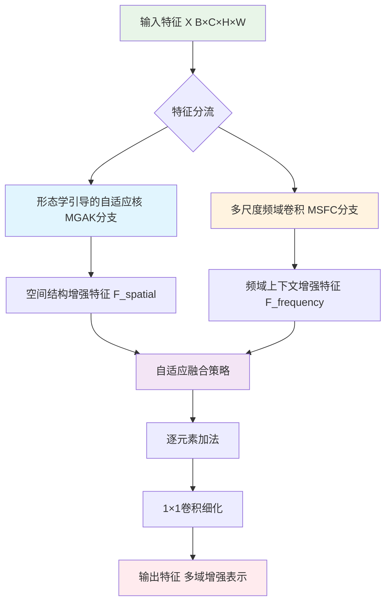
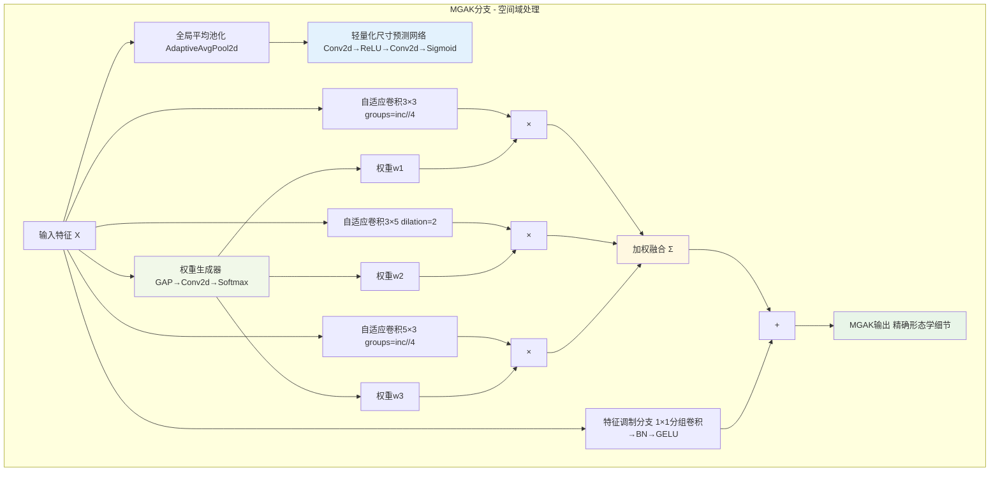

# MDAFE (Multi-Domain Adaptive Feature Extractor) 内部框架图

## 1. 整体架构概览



## 2. MGAK分支详细结构



## 3. MSFC分支详细结构

```mermaid
graph TD
    subgraph MSFC_Branch[MSFC分支 - 频域处理]
        InputMSFC[输入特征 X] --> FDConvMain[FDConv主干 多尺度频域分解]
        
        FDConvMain --> FFT[快速傅里叶变换 FFT]
        FFT --> FreqDecomp[频率分解 k_list=[2,4,8]]
        
        FreqDecomp --> LowFreq[低频成分 全局语义信息]
        FreqDecomp --> MidFreq[中频成分 结构信息]
        FreqDecomp --> HighFreq[高频成分 细节纹理]
        
        LowFreq --> LowFreqAtt[低频注意力 lowfreq_att=True]
        MidFreq --> MidFreqProc[中频处理]
        HighFreq --> HighFreqProc[高频处理]
        
        LowFreqAtt --> AdaptiveWeight[自适应加权机制]
        MidFreqProc --> AdaptiveWeight
        HighFreqProc --> AdaptiveWeight
        
        AdaptiveWeight --> IFFT[逆傅里叶变换 IFFT]
        IFFT --> SpatialConv[空间卷积 spatial_kernel=3]
        
        SpatialConv --> MSFCOutput[MSFC输出 多尺度频域上下文]
    end
    
    style FFT fill:#e1f5fe
    style FreqDecomp fill:#f3e5f5
    style AdaptiveWeight fill:#fff3e0
    style MSFCOutput fill:#ffebee
```

## 4. 自适应融合策略详细结构

```mermaid
graph TD
    subgraph FusionStrategy[自适应融合策略]
        MGAKFeature[MGAK输出特征 F_spatial] --> ChannelAtt[通道注意力机制]
        MSFCFeature[MSFC输出特征 F_frequency] --> ChannelAtt
        
        ChannelAtt --> AttentionCalc[注意力计算 GAP→Conv→ReLU→Conv→Sigmoid]
        
        AttentionCalc --> AttWeight1[注意力权重α1]
        AttentionCalc --> AttWeight2[注意力权重α2]
        
        MGAKFeature --> WeightedMGAK[×]
        AttWeight1 --> WeightedMGAK
        
        MSFCFeature --> WeightedMSFC[×]
        AttWeight2 --> WeightedMSFC
        
        WeightedMGAK --> ElementWiseAdd[逐元素加法 ⊕]
        WeightedMSFC --> ElementWiseAdd
        
        ElementWiseAdd --> FusionConv[融合卷积 Conv2d(outc,outc,1)]
        FusionConv --> BatchNorm[BatchNorm2d]
        BatchNorm --> GELUAct[GELU激活]
        
        GELUAct --> Refine1x1[1×1卷积细化 通道调整与特征细化]
        Refine1x1 --> FinalOutput[最终输出 信息高度浓缩的张量]
    end
    
    style ChannelAtt fill:#e8eaf6
    style ElementWiseAdd fill:#f1f8e9
    style FinalOutput fill:#e8f5e8
```

## 核心技术特性说明

### MGAK分支核心特性
- **轻量化动态核预测**: 使用极简的3个核配置(3×3, 3×5, 5×3)
- **自适应权重生成**: 通过Softmax生成动态权重分配
- **形态学增强**: 针对边缘、纹理和区域形状的精准提取
- **参数效率**: 使用分组卷积和空洞卷积减少参数量

### MSFC分支核心特性
- **多尺度频域分解**: k_list=[2,4,8]实现低、中、高频分离
- **自适应加权融合**: 智能平衡不同频率成分
- **长程依赖建模**: 频域操作天然捕获全局上下文
- **计算效率**: FFT/IFFT快速变换减少计算复杂度

### 融合策略核心特性
- **双域协同**: 空间结构信息与频域上下文信息互补
- **自适应权重**: 基于输入内容动态调整融合比例
- **信息保持**: 逐元素加法保持原始信息完整性
- **特征细化**: 1×1卷积进行最终的特征优化

### 整体优势
- **多域特征表示**: 同时捕获空间几何和频域全局信息
- **自适应性强**: 根据输入内容动态调整处理策略
- **计算高效**: 轻量化设计保证实时性能
- **鲁棒性好**: 对复杂场景和几何变换具有强适应性